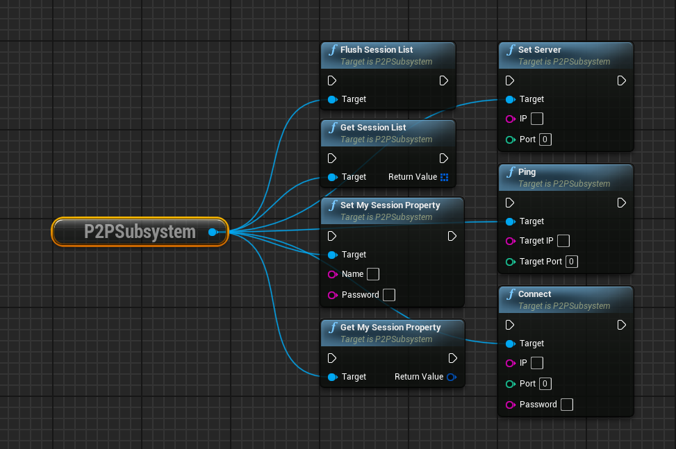
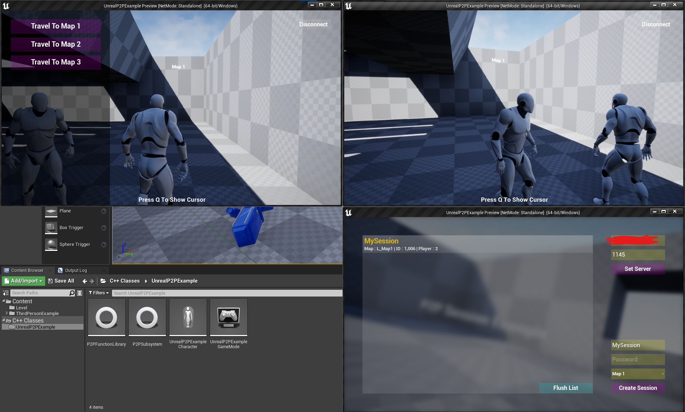
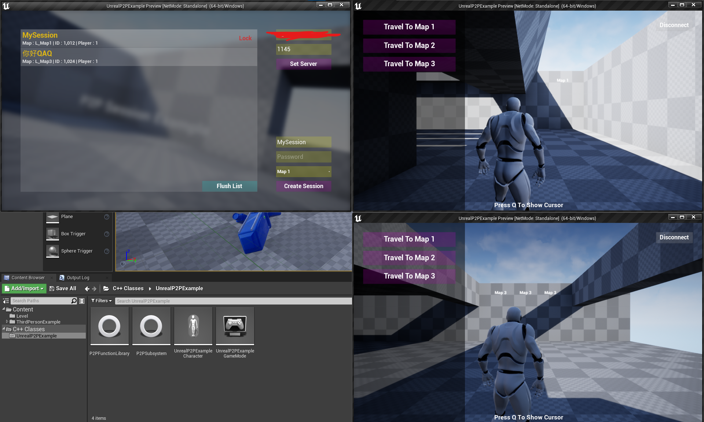
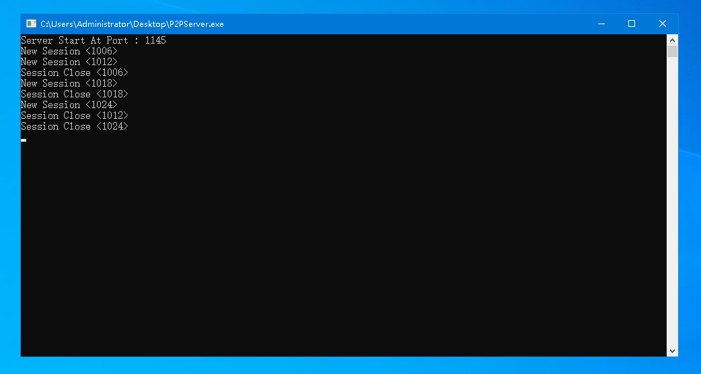
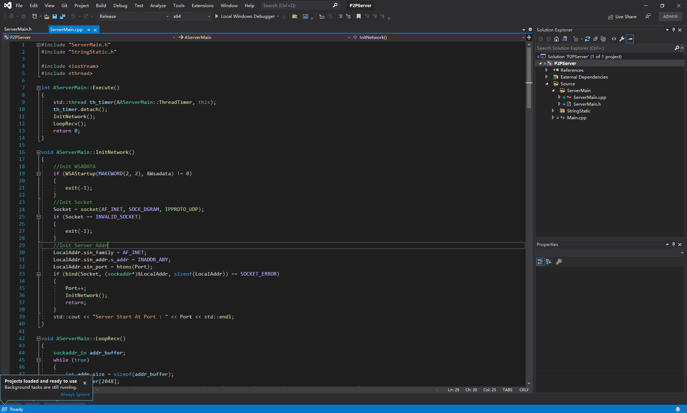

# Unreal Engine P2P 联机示例项目

这是一个使用 **Unreal Engine 4.27** 开发的 **P2P（点对点）联机案例项目**，支持 **Windows PC** 和 **移动端平台（Android）**。

## ✨ 项目特点

- 基于 UE4.27
- 不使用 OnlineSubsystem，使用继承 GameInstanceSubsystem 的自定义 Subsystem 管理联机
- 不自定义 IpNetDriver，无需进行项目设置和ini配置
- 制作了 房间列表、玩家移动、切换地图、连接断连 等基础功能
- 拓展性良好，方便集成到其他项目

## 📷 效果预览

下方展示了项目和游戏内截图：

## 🚀 如何使用

1. 使用 Unreal Engine 4.27（或更高）打开本项目
2. 将 P2PSubsystem 的代码复制到自己的项目
3. 使用里面提供的蓝图函数
4. 编译根目录下的 P2PServer（可选）
5. 在自己的服务器上运行 P2PServer，在客户端输入IP和端口

## 🛠️ 环境要求

- Unreal Engine 4.27（或更高）
- Visual Studio 2019（推荐）

---

本文档部分由AI生成（懒得写）
如有任何问题或建议，欢迎提 Issue 或 Pull Request 😊
